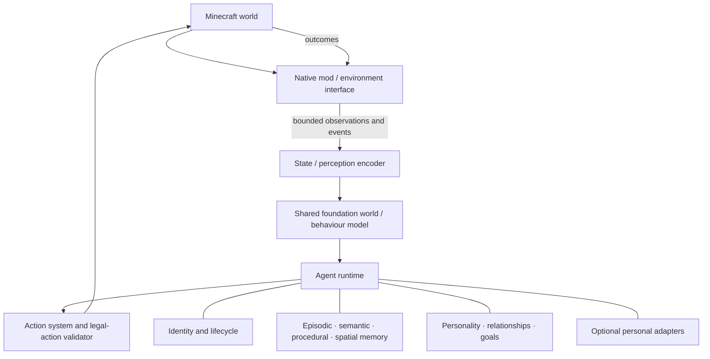

# Proposed Architecture

This is a hypothesis to organize interfaces and experiments, **not a validated implementation**. Focused details live in [`docs/ARCHITECTURE.md`](docs/ARCHITECTURE.md).

The foundation layer may eventually combine world understanding, planning/reasoning, behavioural policy, and language; whether these are one model, multiple models, or hybrid components is unresolved. The runtime binds shared competence to one persistent life. Personal adapters are optional research, not a v0.3 requirement.

## Decision timescales

| Timescale | Responsibility | Example | Initial implementation direction |
| --- | --- | --- | --- |
| Reactive | Immediate control and interruption | avoid fall, continue mining stroke | bounded policy loop; no remote prompt dependency |
| Behavioural | Select and execute short activities | approach tree, eat, answer nearby player | state + memory conditioned policy/skills |
| Deliberative | Plan and reconsider longer goals | establish shelter, prepare expedition | hierarchical planning research |
| Consolidation | Restructure durable state | summarize episodes, revise route confidence | asynchronous, auditable memory jobs |
| Learning | Update shared or personal parameters | offline skill refinement | gated experiments with replay, evaluation, and rollback |

These loops must exchange versioned messages without forcing one cadence. Sleeping or distant agents may reduce cognition frequency while world-critical simulation and identity persistence remain correct.

## Core boundaries

- **Integration boundary:** versioned observations, events, actions, capabilities, and outcomes; no model-specific types.
- **Runtime boundary:** per-agent state, scheduling, memory access, and lifecycle; no implicit singleton identity.
- **Model boundary:** batched inference over agent contexts with explicit state ownership and latency budgets.
- **Persistence boundary:** schema versions, atomic saves, migrations, export/deletion, and provenance.
- **Evaluation boundary:** deterministic/replayable scenarios where possible, plus long-running ecological evaluations that report variance.

## Open decisions

Mod loader, supported Minecraft version, process boundary, observation encoding, model family, training framework, persistence store, inference runtime, and personal adaptation technique remain unresolved. Each needs an issue, experiment, and ADR before commitment.
