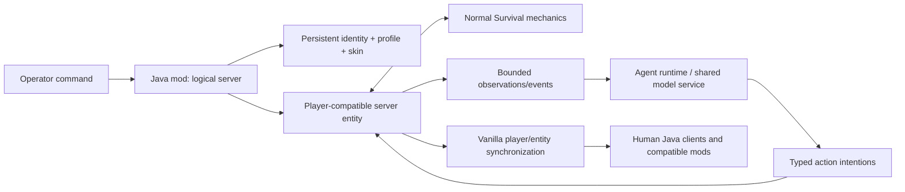

# Java Edition Mod Integration

## User experience target

The project ships as a Minecraft: Java Edition mod with an ordinary distributable JAR or modpack entry. After installing the selected loader and placing the mod in the appropriate `mods` folder, an authorized operator can run:

```text
/spawn ai-agent <username>
```

The command creates or loads one persistent AI player at a policy-approved spawn location. It returns a clear success or error result for duplicate/invalid names, missing runtime capacity, incompatible saves, unavailable skin assets, or failed player creation. Creation must be atomic: a failed command cannot leave a partial identity or orphan entity.

The exact loader, supported Minecraft version, and whether dedicated-server clients need the same mod remain open until the platform comparison is complete. The design target is server-side authority with no required client UI; single-player works because Java Edition runs a logical integrated server.

## Attachment model



The Java mod is the only component attached directly to Minecraft. The default research/model runtime is out-of-process through the asynchronous, versioned local boundary defined in [RUNTIME_BOUNDARY.md](RUNTIME_BOUNDARY.md); a narrow in-process Java implementation remains available for deterministic tests and simple spikes. Neither path may change Minecraft-facing semantics. The logical-server tick never waits synchronously for model inference. If the runtime is unavailable, the entity safely idles or is paused according to operator policy rather than being driven by a fallback chatbot.

## Player embodiment contract

The implementation should use the closest stable, maintainable player-compatible server abstraction offered by the selected version/loader. The purpose is behavioural and protocol parity, not authentication impersonation. Each AI has a project-owned UUID/profile namespace and cannot claim a real account's authenticated identity.

Other players should see ordinary player behaviour wherever feasible:

- player model, chosen skin, username, nameplate, animation, held/equipped items, and armour;
- entity tracking, collision, targeting, damage, knockback, effects, sounds, and death/respawn;
- player list/tab presentation, chat formatting, scoreboards/teams, death messages, and locator-map markers;
- interactions with blocks, entities, containers, item pickup/drop, crafting, sleeping, portals, and server permissions;
- moderation and operator controls comparable to other connected players.

Vanilla and third-party systems sometimes identify players through connection/session assumptions rather than entity type alone. Therefore “looks like a player everywhere” is a compatibility target backed by a matrix and tests, not an unsupported guarantee. Any shim must preserve server authority and must not create a fake authenticated network session.

## Survival parity

New agents default to Survival. Their game mode and spawn placement may be changed only by ordinary authorized server administration. They receive no starter items or privileged knowledge unless a specific experiment declares that intervention.

The mod must not implement parallel approximations of health, hunger, inventory, recipes, armour, damage, or physics. It should route actions through Minecraft's existing server logic so the same preconditions, timing, resources, events, and consequences apply. Conformance tests compare human and AI player state transitions for representative operations, including death and reload.

## Identity and skin lifecycle

On first successful creation, the runtime stores:

- internal immutable agent ID and project-owned player UUID;
- unique display username and normalized lookup form;
- creation world/time and lifecycle state;
- skin catalog ID, content hash, model geometry metadata, and provenance/license record;
- Minecraft inventory/position/status persistence references;
- personal runtime/memory references.

A skin is chosen randomly once from an installed, curated catalog of redistributable popular Minecraft-style skins. The assignment is persisted, so unload, server restart, death, respawn, and runtime reconnection do not reroll it. Operators may explicitly change a skin; changes are audited and do not change identity. Missing assets fail visibly or use a documented bundled fallback without selecting a new identity silently.

Remote skin catalogs are optional and disabled unless explicitly configured. Downloads require integrity checks, caching, timeouts, content validation, and license/provenance metadata. Arbitrary player-account skin scraping or identity impersonation is out of scope.

## Lifecycle commands

`/spawn ai-agent <username>` is the required first command. Follow-up design should cover list, pause/resume, despawn-without-deletion, inspect, export, change-skin, and delete operations. Despawn is not deletion: identity, skin, inventory, memories, relationships, and other life state remain durable. Destructive deletion requires a separate explicit command, authorization, confirmation policy, and audit trail.

Commands are operator controls outside the agent's ontology. Chat addressed to an AI is ordinary in-world communication and goes through the grounded language pathway; it is not parsed as an administrative command channel.

## Installation and compatibility quality bar

- One documented installation path produces a verifiable mod JAR.
- Single-player/integrated-server and dedicated-server smoke tests are automated where practical.
- Loader, Minecraft, Java, protocol, save-schema, and client compatibility versions are explicit.
- World backups and migrations are documented before upgrades.
- A compatibility matrix covers vanilla clients plus representative map, permissions, and server-management integrations.
- Removing or disabling the mod fails safely and leaves recoverable agent data; worlds must not be silently corrupted.
